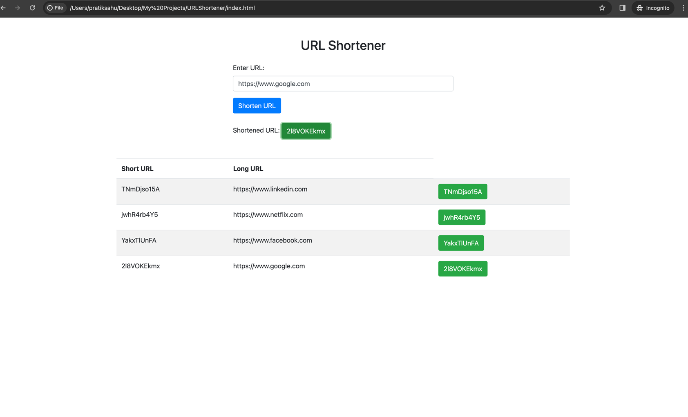

# URL Shortener - AWS Lambda Service (Free Tier Optimized)

A serverless URL shortening service built with AWS Lambda, API Gateway, and DynamoDB, **optimized for AWS Free Tier usage**.



## 🆓 **AWS Free Tier Features**

- **Lambda**: 1 million free requests per month
- **DynamoDB**: 25GB free storage + 25WCU/25RCU per month  
- **API Gateway**: 1 million free API calls per month
- **Data Transfer**: 15GB free per month
- **Cost Optimization**: In-memory caching to reduce DynamoDB calls

## ✨ **Features**

- **URL Shortening**: Convert long URLs to short codes
- **URL Redirection**: Redirect short codes to original URLs
- **Persistent Storage**: DynamoDB integration for reliable data persistence
- **Click Analytics**: Track click counts and usage statistics
- **URL Validation**: Automatic URL format validation and sanitization
- **Free Tier Optimized**: Smart caching to minimize costs
- **Serverless**: Built with AWS Lambda for cost-effective scaling
- **RESTful API**: Clean HTTP endpoints for easy integration

## 🚀 **Quick Start (Free Tier)**

### 1. **Deploy with One Command**
```powershell
.\deploy.ps1
```

### 2. **Test Your Service**
```bash
# Get service info
curl https://your-api-id.execute-api.region.amazonaws.com/dev/

# Shorten a URL
curl -X POST https://your-api-id.execute-api.region.amazonaws.com/dev/shorten \
  -H "Content-Type: application/json" \
  -d '{"url": "https://example.com/very-long-url"}'
```

## 📡 **API Endpoints**

### 1. **Shorten URL**
- **Method**: `POST`
- **Path**: `/shorten`
- **Body**: `{"url": "https://example.com/very-long-url"}`
- **Response**: 
```json
{
  "shortCode": "a1b2c3d4",
  "longUrl": "https://example.com/very-long-url",
  "shortUrl": "https://your-domain.com/a1b2c3d4",
  "message": "URL shortened successfully (Free Tier Optimized)"
}
```


### 2. **Redirect URL**
- **Method**: `GET`
- **Path**: `/redirect/{shortCode}`
- **Response**: HTTP 302 redirect to original URL


### 3. **URL Statistics**
- **Method**: `GET`
- **Path**: `/stats/{shortCode}`
- **Response**: Click count, creation time, and URL details

### 4. **Service Info**
- **Method**: `GET`
- **Path**: `/`
- **Response**: Service information, endpoints, and Free Tier limits

## 💰 **Free Tier Cost Optimization**

### **Smart Caching Strategy**
- **In-Memory Cache**: 100 most accessed URLs stored locally
- **Reduced DynamoDB Calls**: Cache hits avoid database queries
- **Conditional Writes**: Prevent duplicate URL storage
- **Batch Operations**: Efficient database updates

### **Resource Optimization**
- **Lambda Memory**: 128MB (minimum for cost efficiency)
- **Timeout**: 15 seconds (reduced from 30s)
- **DynamoDB**: Pay-per-request billing (no provisioned capacity)
- **TTL**: Automatic cleanup of old URLs

## 🏗️ **Architecture**

```
┌─────────────┐    ┌──────────────┐    ┌─────────────┐
│   Client    │───▶│ API Gateway  │───▶│   Lambda    │
└─────────────┘    └──────────────┘    └─────────────┘
                           │                    │
                           │                    ▼
                           │            ┌─────────────┐
                           │            │   Cache     │
                           │            │  (100 URLs) │
                           │            └─────────────┘
                           │                    │
                           ▼                    ▼
                    ┌──────────────┐    ┌─────────────┐
                    │   DynamoDB   │◀───│   Lambda    │
                    │   (Storage)  │    │ (Fallback)  │
                    └──────────────┘    └─────────────┘
```

### **AWS Lambda Functions**


### **DynamoDB Database**


### **API Gateway Configuration**


## 📊 **Free Tier Usage Monitoring**

### **AWS Cost Explorer**
```bash
# Check current month costs
aws ce get-cost-and-usage \
  --time-period Start=2024-01-01,End=2024-01-31 \
  --granularity MONTHLY \
  --metrics BlendedCost
```

### **Set Up Billing Alerts**
1. Go to AWS Billing Console
2. Set up billing alerts (e.g., $1.00 threshold)
3. Monitor Free Tier usage in real-time

### **Free Tier Limits Dashboard**
- **Lambda**: Monitor request count and duration
- **DynamoDB**: Check storage and request units
- **API Gateway**: Track API call count
- **Data Transfer**: Monitor outbound bandwidth

## 🚨 **Free Tier Limits & Warnings**

### **Monthly Limits**
- **Lambda**: 1M requests, 400,000 GB-seconds
- **DynamoDB**: 25GB storage, 25WCU/25RCU
- **API Gateway**: 1M API calls
- **Data Transfer**: 15GB outbound

### **What Happens After Free Tier**
- **Lambda**: $0.20 per 1M requests
- **DynamoDB**: $1.25 per 1M requests + $0.25/GB storage
- **API Gateway**: $3.50 per 1M API calls
- **Data Transfer**: $0.09 per GB

### **Cost Control Strategies**
1. **Use 'dev' environment** for testing
2. **Monitor usage** with CloudWatch
3. **Set up billing alerts** early
4. **Use caching** to reduce database calls
5. **Clean up old data** with TTL

## 🧪 **Local Testing**

### **DynamoDB Local**
```bash
# Start local DynamoDB
docker-compose up -d

# Test locally
python test_dynamodb.py

# Stop services
docker-compose down
```

### **Lambda Testing**
```bash
# Test Lambda handler locally
python main.py
```

## 📦 **Deployment**

### **Automatic Deployment**
```powershell
# Deploy to dev environment (Free Tier)
.\deploy.ps1 -Environment dev

# Deploy to prod (may exceed free tier)
.\deploy.ps1 -Environment prod
```

### **Manual Deployment**
```bash
# Create deployment package
pip install -r requirements.txt -t temp-package/
zip -r lambda-deployment.zip temp-package/

# Deploy with CloudFormation
aws cloudformation deploy \
  --template-file template.yaml \
  --stack-name url-shortener-free-tier \
  --capabilities CAPABILITY_IAM
```

## 🔧 **Configuration**

### **Environment Variables**
```bash
DOMAIN=your-domain.com
ENVIRONMENT=dev          # Use 'dev' for free tier
DYNAMODB_TABLE=url-shortener-dev
```

### **Lambda Settings**
- **Runtime**: Python 3.9
- **Memory**: 128MB (Free Tier optimized)
- **Timeout**: 15 seconds
- **Handler**: main.lambda_handler

## 📈 **Scaling & Production**

### **When Free Tier Isn't Enough**
1. **Monitor costs** in AWS Console
2. **Optimize code** for efficiency
3. **Consider provisioned capacity** for DynamoDB
4. **Use CloudFront** for global distribution
5. **Implement rate limiting** to control costs

### **Production Considerations**
- **Custom Domain**: Route 53 + API Gateway
- **SSL Certificate**: ACM for HTTPS
- **Monitoring**: CloudWatch + X-Ray
- **Backup**: DynamoDB point-in-time recovery
- **Security**: IAM roles and policies

## 🆘 **Troubleshooting**

### **Common Free Tier Issues**
1. **Billing Alerts**: Set up early to avoid surprises
2. **Resource Limits**: Check service quotas
3. **Cold Starts**: Normal for Lambda (100-500ms)
4. **Cache Misses**: First requests hit DynamoDB

### **Cost Optimization Tips**
- **Use caching** effectively
- **Monitor DynamoDB** request units
- **Optimize Lambda** execution time
- **Clean up** unused resources

## 📚 **Additional Resources**

- [AWS Free Tier](https://aws.amazon.com/free/)
- [Lambda Pricing](https://aws.amazon.com/lambda/pricing/)
- [DynamoDB Pricing](https://aws.amazon.com/dynamodb/pricing/)
- [API Gateway Pricing](https://aws.amazon.com/api-gateway/pricing/)
- [Cost Optimization](https://aws.amazon.com/cost-optimization/)

## 🎯 **Next Steps**

1. **Deploy**: Run `.\deploy.ps1` to get started
2. **Test**: Use the provided endpoints
3. **Monitor**: Set up billing alerts
4. **Optimize**: Use caching and efficient operations
5. **Scale**: Upgrade when needed

---

**⚠️ Important**: This service is optimized for AWS Free Tier. Monitor your usage and set up billing alerts to avoid unexpected charges. Free Tier expires after 12 months. 
